# check_nokia_isam

A Nagios-Plugin to check multiple services on Nokia ISAM devices.


### Description


This plugin can be used to check the following services on Nokia ISAMs:

- board_availability

  Availability Status of all boards (CLI: "show equipment slot")


- board_oper_status

  Operational Status of all boards (CLI: "show equipment slot")


- auto_backup_status

  Status of the auto-backup feature (CLI: show software-mngt upload-download)
  
  DB-Download and DB-Upload progress and error status is checked. DB-Download representing the status of the download from the ISAM to the local backup location and DB-Upload representing the status of the upload to the remote fileserver location previously configured via CLI.


- pon_utilization

  Current RX/TX utilization of all PON interfaces (CLI: show pon utilization current-interval)
  
  Warning and Critical thresholds can be set globally for all PON interfaces. Recommended values are 80% as warning and 85% as critical threshold. This can help you identify high usage on PONs and plan your move to XGS-PON or reduce your splitting ratio.


- board_temperature

  Temperature Sensors of all boards (CLI: show equipment temperature)
  
  Warning and Critical thresholds are automatically set to the tca-low and shut-low threshold of each sensor. "tca-low" is the threshold of the boards sensor when the "Temperature exceeded" alarm is raised and "shut-low" is the threshold when the "Temperature shutdown" alarm is raised. Crossing the "shut-high" threshold (which is typically ~5°C higher than "shut-low") puts the board into temperature-shutdown, impacting customer services.


- nt_redundancy

  NT-Redundancy Status of a Protection Group (CLI: show equipment protection-group, show equipment protection-element)
  
  The admin-state, group-state, standby-state of NT-A and NT-B and the last switchover reason are checked.


- power_supply

  The Power Supply status of the shelf (acu:1/1 -> NGFC) (CLI: show equipment power-supply)

  If BAT-A or BAT-B reports 0 volts Vin or the flag fault-detected (temperature, over/under-voltage, over-current or over-power) is set an alarm is triggered.


### Dependencies


- Python 3 (easysnmp installed via pip)
- OMD, Check_MK or other Monitoring solutions
- SNMP-enabled OSWP-image installed on the Mgmt-Board (FANT-F)
- SNMPv2 enabled on your Nokia ISAM

  (configure system security snmp community MY-SNMP-COMM host-address MY-MGMT-NET/24)


### Tested on the following systems


- OMD 5.0 (Ubuntu 22) with Python 3.10
- Nokia ISAM 7360 FX-8 (OSWP 6.2, 6.6) with FANT-F


### Installation


Copying it to your local plugin folder should be enough.


### Usage

```
python3 ../check_isam.py --help
Usage:
 check_isam.py --board_availability -s <host> -c <community> -v [verbose]
 check_isam.py --board_oper_status  -s <host> -c <community> -v [verbose]
 check_isam.py --auto_backup_status -s <host> -c <community> -v [verbose]
 check_isam.py --pon_utilization    -s <host> -c <community> -W <warning (1-99)> -C <critical (2-100)> -v [verbose]
 check_isam.py --board_temperature  -s <host> -c <community> -v [verbose]
 check_isam.py --nt_redundancy      -s <host> -c <community> -g <groupId (1-5)> -v [verbose]
 check_isam-py --power_supply       -s <host> -c <community>

Options:
  --version             show program's version number and exit
  -h, --help            show this help message and exit
  --board_availability  checks the availability status of all boards
  --board_oper_status   checks the operational status of all boards
  --auto_backup_status  checks the status of the auto-backup feature
  --pon_utilization     checks the utilization of all PON interfaces
  --board_temperature   checks the temperature sensors on all boards
  --nt_redundancy       checks the NT redundancy status of the given
                        protection-group
  -s HOSTNAME           specify hostname
  -c COMMUNITY          specify SNMPv2 community
  -v                    turn on debug output
  -W WARNING            specify a warning threshold
  -C CRITICAL           specify a critical threshold
  -g GROUPID            specify a protection-group ID (1-5)
```

### OMD command and service definition


The command and service definitions for OMD should look something like this.

commands
```
define command {
  command_name                   check_isam_configbackup
  command_line                   python3 $USER5$/check_isam.py --auto_backup_status -s $HOSTADDRESS$ -c $ARG1$
}
define command {
  command_name                   check_isam_board_availability
  command_line                   python3 $USER5$/check_isam.py --board_availability -s $HOSTADDRESS$ -c $ARG1$
}
define command {
  command_name                   check_isam_board_operational_status
  command_line                   python3 $USER5$/check_isam.py --board_oper_status -s $HOSTADDRESS$ -c $ARG1$
}
define command {
  command_name                   check_isam_board_temperature
  command_line                   python3 $USER5$/check_isam.py --board_temperature -s $HOSTADDRESS$ -c $ARG1$
}
define command {
  command_name                   check_isam_pon_utilization
  command_line                   python3 $USER5$/check_isam.py --pon_utilization -s $HOSTADDRESS$ -c $ARG1$ -W $ARG2$ -C $ARG3$
}
define command {
  command_name                   check_isam_nt_redundancy
  command_line                   python3 $USER5$/check_isam.py --nt_redundancy -s $HOSTADDRESS$ -c $ARG1$ -g $ARG2$
}
define command {
  command_name                   check_isam_power_supply
  command_line                   python3 $USER5$/check_isam.py --power_supply -s $HOSTADDRESS$ -c $ARG1$
}
```

services
```
define service {
  service_description            Configbackup Status
  host_name                      hostname_isam
  use                            service-template-interval-2h
  check_command                  check_isam_configbackup!MySnmpComm
}
define service {
  service_description            ISAM Board Availability
  host_name                      hostname_isam
  use                            service-template-interval-5min
  check_command                  check_isam_board_availability!MySnmpComm
}
define service {
  service_description            ISAM Board Operational-Status
  host_name                      hostname_isam
  use                            service-template-interval-5min
  check_command                  check_isam_board_operational_status!MySnmpComm
}
define service {
  service_description            ISAM Board Thermal-Status
  host_name                      hostname_isam
  use                            service-template-interval-5min
  check_command                  check_isam_board_temperature!MySnmpComm
}
define service {
  service_description            ISAM PON Utilization
  host_name                      hostname_isam
  use                            service-template-interval-5min
  check_command                  check_isam_pon_utilization!MySnmpComm!80!85
}
define service {
  service_description            ISAM NT-Redundancy Status
  host_name                      hostname_isam
  use                            service-template-interval-5min-iol-one-notification
  check_command                  check_isam_nt_redundancy!MySnmpComm!ProtectionGroupId
}
define service {
  service_description            ISAM Power Supply
  host_name                      hostname_isam
  use                            service-template-interval-5min-iol-one-notification
  check_command                  check_isam_power_supply!MySnmpComm
}
```

### Some sample Outputs

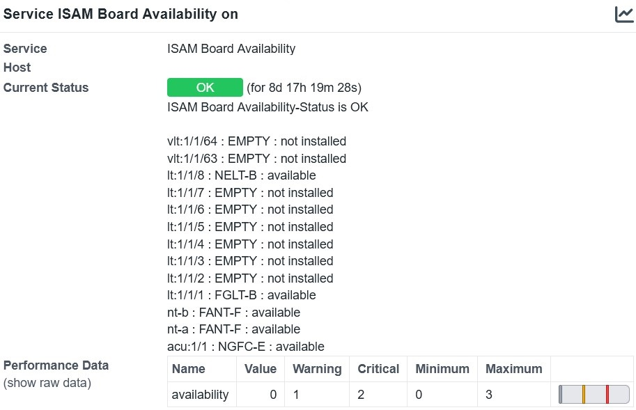

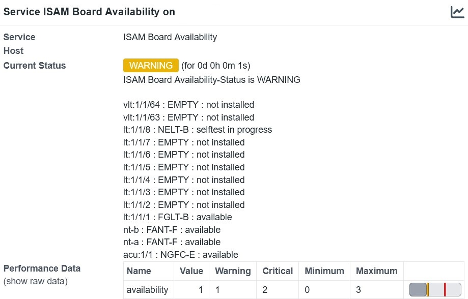

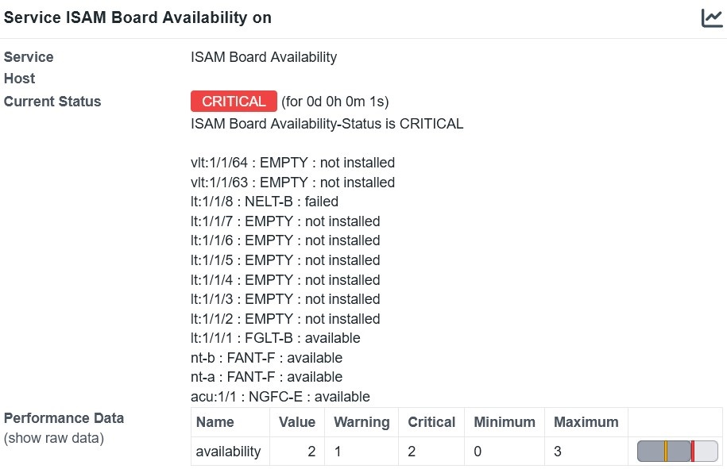

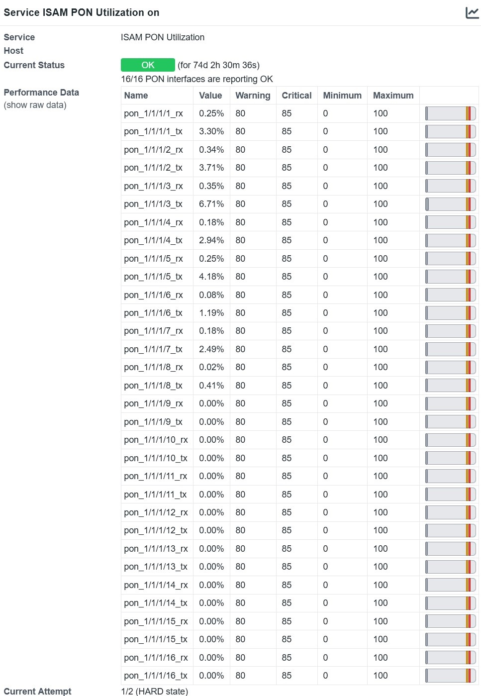

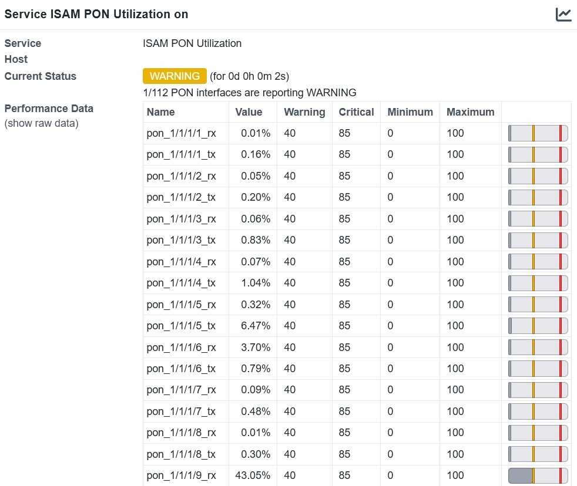

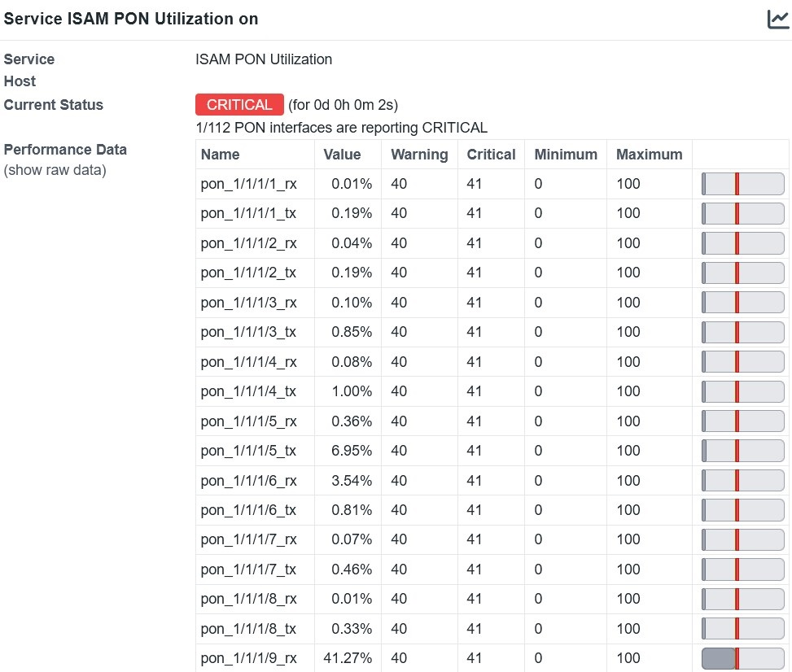

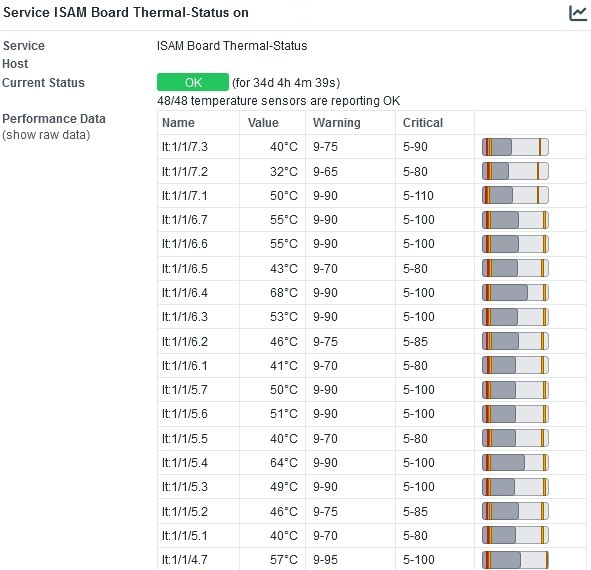

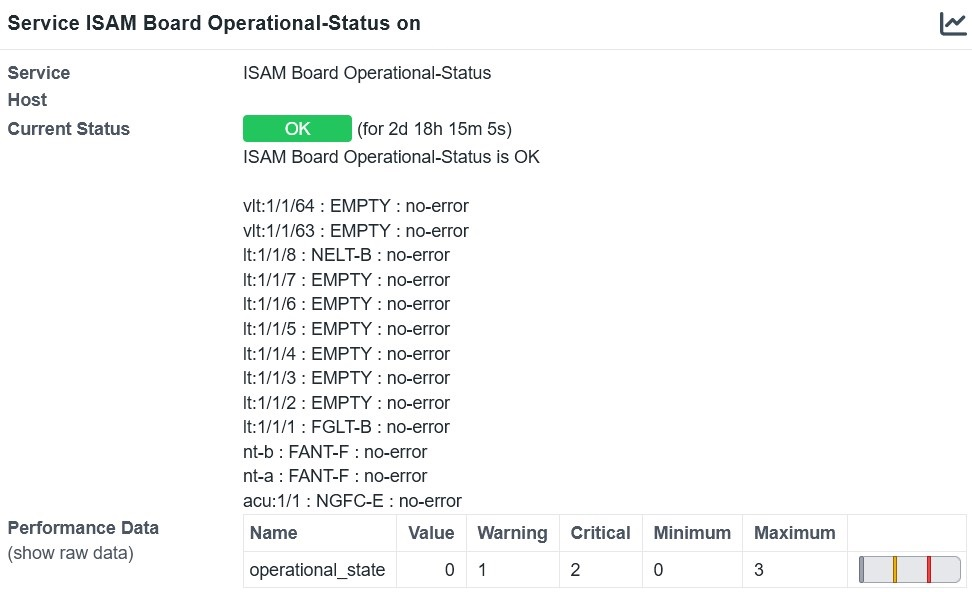

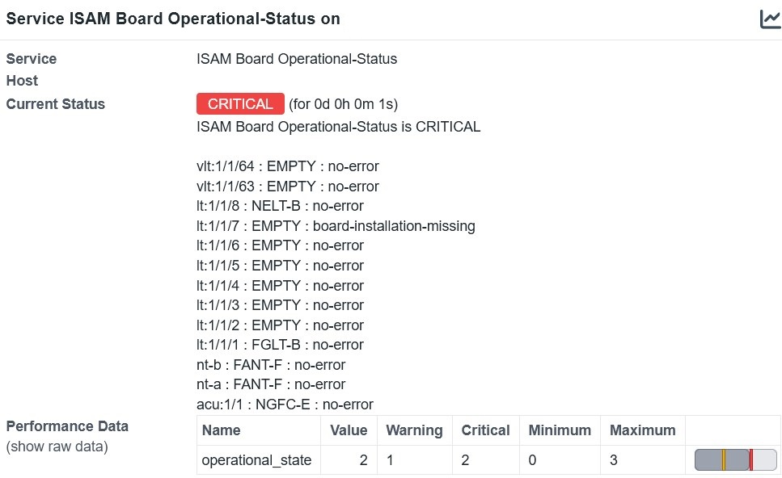

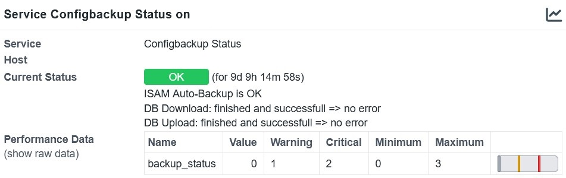

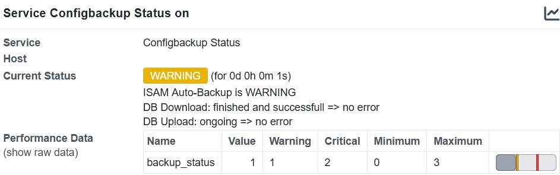

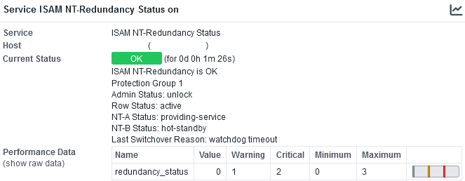

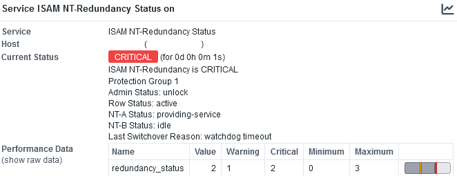

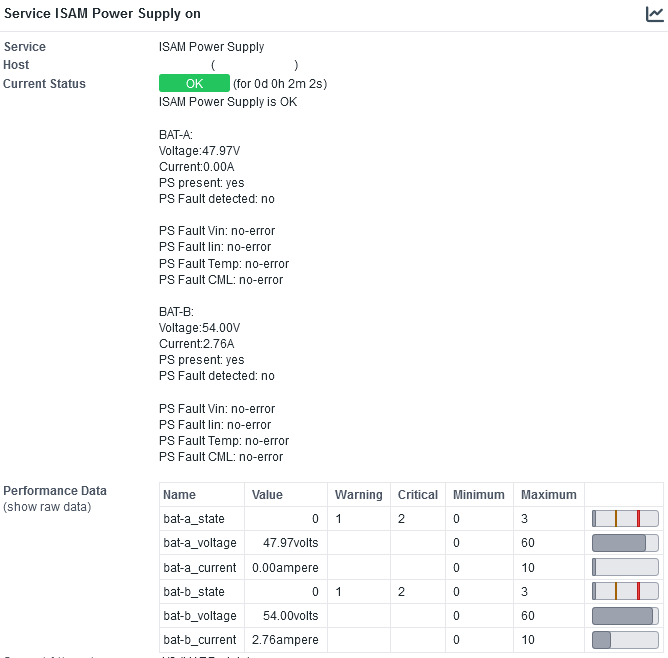

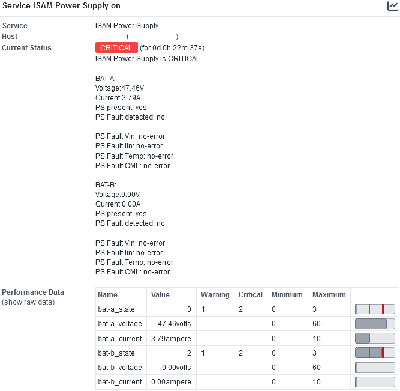


### License

This project is licensed under the GNU General Public License v3.0 License - see the LICENSE.md file for details
